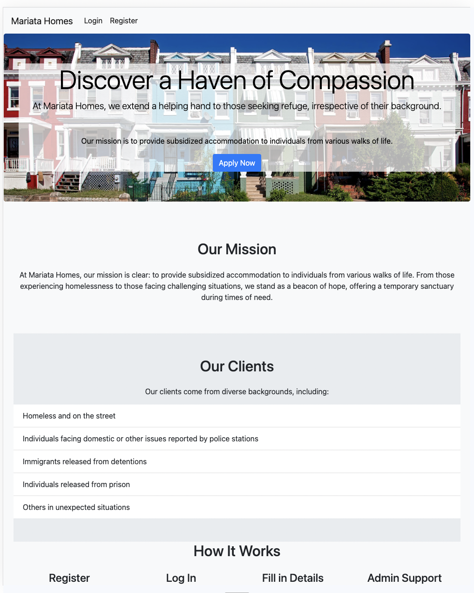
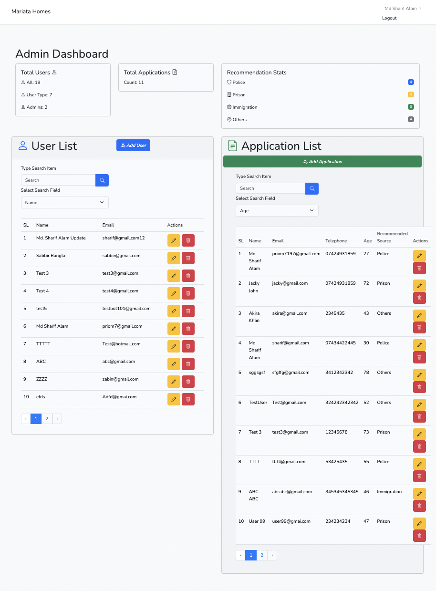
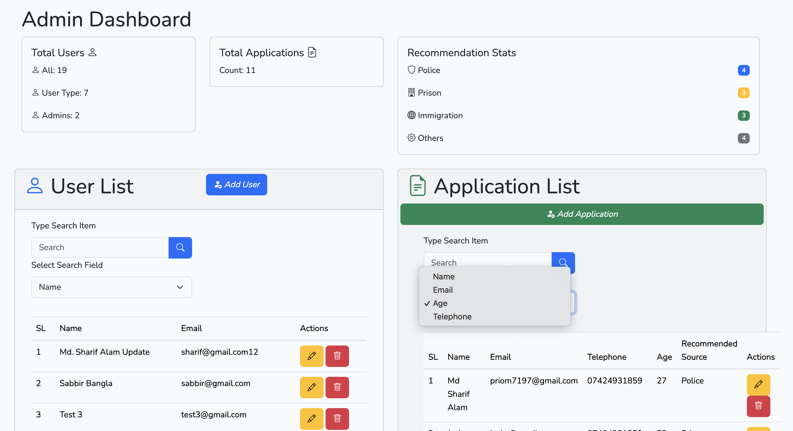
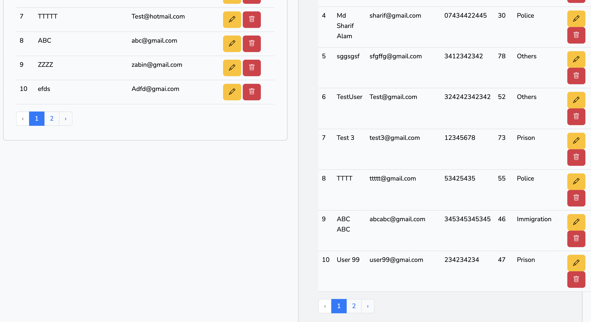

Mariata Homes, is an Web app made with Laravel and MySQL. A CRUD application for managing data of homeless people seeking for temporary shelter.

## Miriata Homes Desktop App. 

      git clone https://github.com/Priom7/Mariata-Homes-Web-App.git

      cd mariata-homes

      composer install 

      php artisan key:generate

      setup .env

      npm install 

      php artisan migrate:refresh --seed

      php artisan serve

## App UI 

